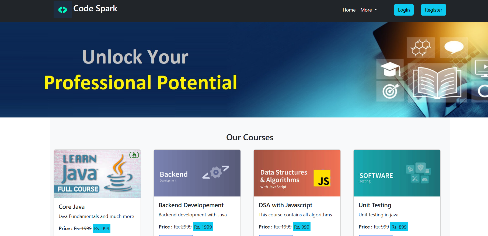
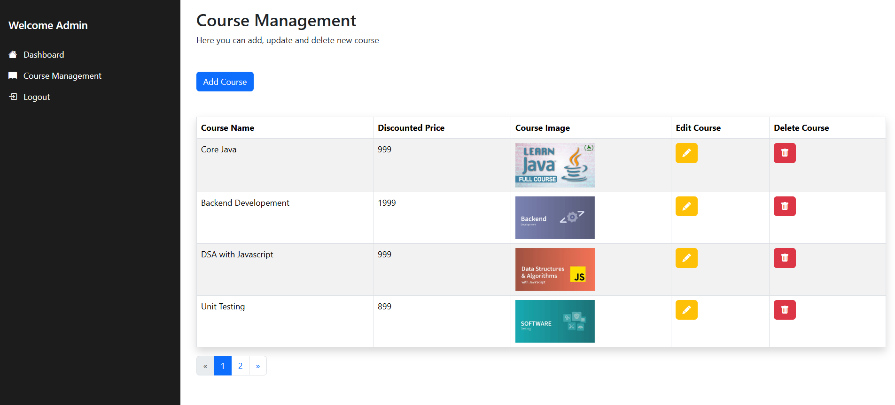

# Code Spark

Code Spark is a web application platform that offers programming-related courses to users. It provides features for users to register, log in, edit their profiles, purchase courses, and for administrators to manage the courses effectively.

---

## Features

### User Features
- **Register**: Users can sign up for the platform.
- **Login**: Users can log in to access their accounts.
- **Edit Profile**: Users can update their profile information.
- **Purchase Courses**: Users can explore and purchase programming courses.

### Admin Features
- **Create Course**: Administrators can add new courses.
- **Update Course**: Administrators can modify course details.
- **Delete Course**: Administrators can remove courses from the platform.

---

## Technologies Used

### Backend
- **Java**: The core programming language for backend development.
- **Spring Boot**: Framework for building the application.
- **Spring Data JPA**: To handle database operations.

### Frontend
- **HTML**: For structuring the web pages.
- **Bootstrap**: For responsive and styled user interfaces.
- **JavaScript**: Adds interactivity for sending queries and displaying responses.
- **Thymeleaf**: For dynamic templates and server-side rendering.

### **DevOps**:
- **Maven**: Dependency management and build automation.
- **Postman**: For testing and debugging API endpoints.
- **Git/GitHub**: Version control and code hosting.

---

## Project Setup

### Prerequisites
Ensure you have the following installed:
- Java 17 or higher
- Maven
- MySQL or any other database server

## Usage

### Default Roles
- **Admin Credentials**: 
  - Username: `admin`
  - Password: `admin123`
- **User Registration**: Any user can register and log in.

### Pages
- **Home**: Displays available courses.
- **Admin Dashboard**: Allows course management.

---

## Screenshots

### Home Page


### Admin Dashboard


---


### Steps to Set Up
1. **Clone the Repository**:
   ```bash
   git clone https://github.com/your-username/code-spark.git
   cd code-spark
   ```

2. **Set Up the Database**:
   - Create a MySQL database named `code_spark`.
   - Update the database configuration in `application.properties`:
     ```properties
     spring.datasource.url=jdbc:mysql://localhost:3306/code_spark
     spring.datasource.username=your-username
     spring.datasource.password=your-password
     spring.jpa.hibernate.ddl-auto=update
     ```

3. **Build the Project**:
   ```bash
   mvn clean install
   ```

4. **Run the Application**:
   ```bash
   mvn spring-boot:run
   ```

5. **Access the Application**:
   Open your browser and navigate to `http://localhost:8080`.

---


